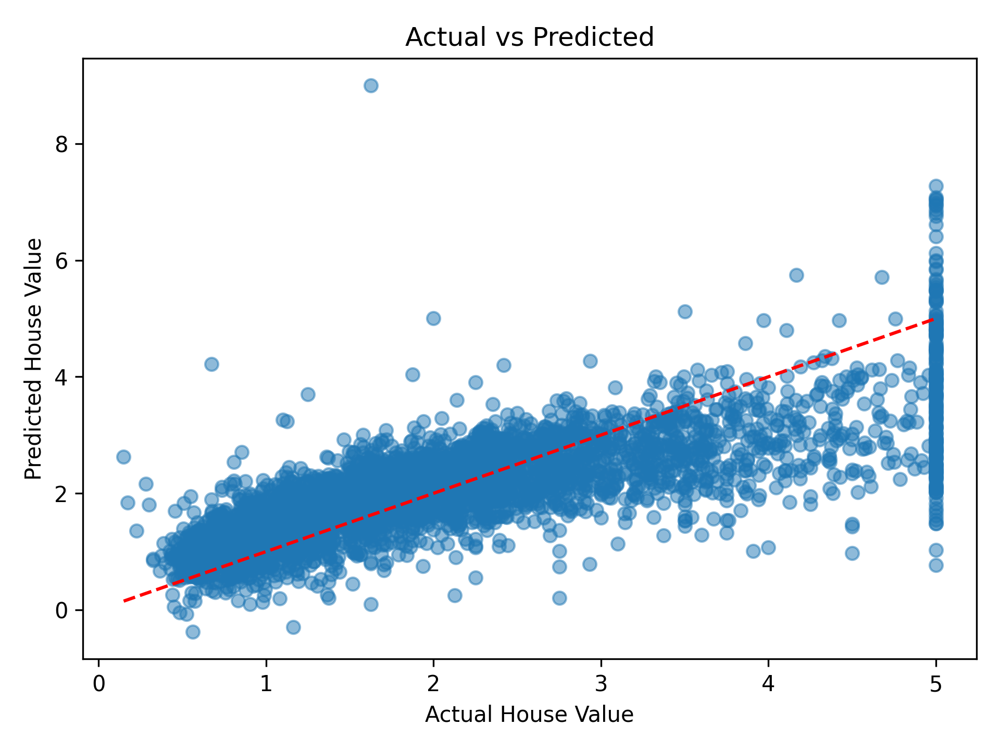
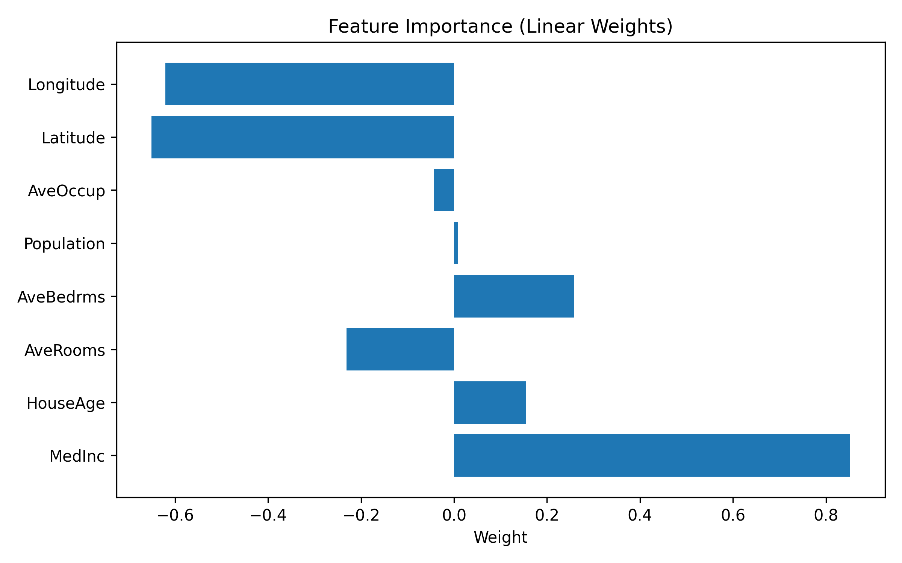
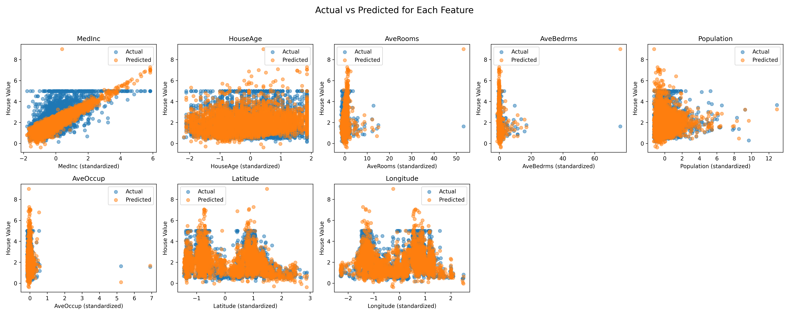

# California Housing Price Prediction - Linear Regression

本プロジェクトでは、**California Housing** データセットを用いた **線形回帰** により、住宅価格の予測モデルを構築します。
学習→推論→可視化の結果と、**キャッシュ再利用による再現方法** をまとめています。

---

## 🔧 セットアップ

下記いずれかで依存関係を導入します。

### 1) `uv` / `pip` でパッケージとして開発インストール（推奨）

```bash
# uv を使う場合（推奨）
uv pip install -e .

# もしくは pip
pip install -e .
```

### 2) 既存の `requirements.txt` を使う場合（任意）

```bash
pip install -r requirements.txt
```

> **補足**: 本リポジトリは `pyproject.toml` ベースでの開発インストール（`-e`）を想定しています。
> `requirements.txt` は補助的に利用できます。

---

## ▶ 実行方法（既存スクリプト）

既存スクリプトでの実行手順です。**ファイル名は `linner.py`** です（`liner.py` ではありません）。

```bash
python linner.py
```

* 実行すると `out/weightN`（N は連番）が自動生成され、学習結果・可視化が保存されます。

> 将来的に、本プロジェクトは `mlmini` という CLI を提供予定です（現在はスケルトン）。
> インストール後に `mlmini` を実行すると、案内メッセージが表示されます。
> （回帰/分類のサブコマンドは後続コミットで有効化されます）

```bash
# 参考（現状はプレースホルダ）
mlmini
```

---

## 🧠 キャッシュの仕組みと再利用

`linner.py` では、出力先ディレクトリとして `out/weightN`（N は連番）を自動生成します。
該当箇所（例）:

```python
# --- 設定 ---
root_path = Path(str(ROOT_DIR))
OUTPUT_PATH = root_path / "out"

weight_dir_count = count_matching_dirs(str(OUTPUT_PATH), r"^weight[0-9]+$")
OUTPUT_PATH_WEIGHT = OUTPUT_PATH / f"weight{weight_dir_count + 1}"
```

すでに存在する `out/weightN` から **キャッシュ（例: `cache_preprocessed_data.pt`）** と
**スケーラー（`scaler.pkl`）** を **新しい出力先** にコピーすることで、
**再計算なしで同じ結果を再現** できます。

例:

```bash
# 既存の weight1 から新規 weight2 へキャッシュとスケーラーをコピー
cp out/weight1/cache_preprocessed_data.pt out/weight2/
cp out/weight1/scaler.pkl out/weight2/
```

> **注**: 出力物の配置は将来的に `model/`, `figures/`, `cache/` のサブディレクトリへ整理予定です（後方互換は維持）。

---

## 📊 可視化結果の説明

### 1. `ideal_line.png`



* **内容**: 実測値と予測値の散布図。
* **赤の破線**: 理想線（予測＝実測）。
* **読み取り方**: 点が赤線に近いほどモデル精度が高い。

---

### 2. `importance_weight.png`



* **内容**: 特徴量の重要度（回帰係数）の棒グラフ。
* **正の重み**: 価格と正の相関（例: `MedInc`）。
* **負の重み**: 価格と負の相関（例: `Longitude`, `Latitude`）。

---

### 3. `prediction_grid.png`



* **内容**: 特徴量ごとの実測 vs 予測の比較。
* **所見**: `MedInc`（世帯中央値収入）が最も影響力大。
  他の特徴量の寄与度も全体傾向として把握可能。

---

## 📂 出力構成（現状）

```
out/
├── weight1/
│   ├── cache_preprocessed_data.pt
│   ├── scaler.pkl
│   ├── ideal_line.png
│   ├── importance_weight.png
│   └── prediction_grid.png
```

> **将来**: `out/weightN/{model, figures, cache}` に整理予定（互換を損なわない形で移行）。

---

## ⚠ 注意事項

* **重回帰** を採用しているため、複数の特徴量を使用します。
* 特徴量や目的変数を変える場合は、`setup_linear_regression_data()` の引数を適切に調整してください。
* 既存の学習/可視化ロジックは維持しつつ、段階的にコード分割・ドキュメント整備を進めています。

---

## 📘 使用ライブラリ（代表）

* scikit-learn
* matplotlib
* torch
* numpy

---

## 🔜 ロードマップ（簡易）

* [x] 既存スクリプトでの学習・可視化
* [x] パッケージ骨格（`src/mlmini/`）追加（後方互換を維持）
* [x] `mlmini` CLI のスケルトン追加
* [ ] 回帰/分類ロジックの段階的移設（関数分割・docstring 完備）
* [ ] 可視化ユーティリティの共通化
* [ ] Django 連携（管理コマンド + 推論API）
